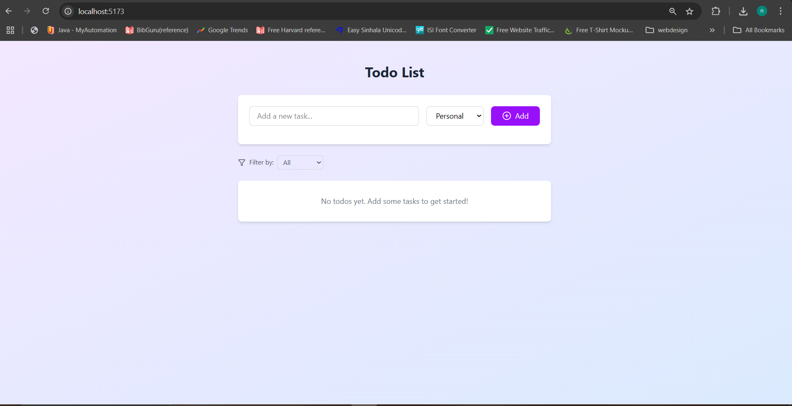

# Interactive Todo List with Categories

This is an interactive to-do list application built with React. The app allows users to add tasks, categorize them, and filter tasks based on categories. It also includes the ability to delete tasks.



## Features

- **Add Tasks**: Users can add tasks to the to-do list with the option to select a category (Work, Personal, Shopping).
- **Filter by Category**: Users can filter tasks by category or view all tasks.
- **Delete Tasks**: Users can remove tasks from the list.
- **Responsive UI**: The app has a clean, modern UI built using Tailwind CSS.

## Technologies Used

- **React**: A JavaScript library for building user interfaces.
- **Tailwind CSS**: A utility-first CSS framework for styling.
- **Lucide Icons**: A set of open-source icons used in the app.

## Setup Instructions

### 1. Clone the repository:

```bash
git clone https://github.com/your-username/interactive-todo-list.git
cd interactive-todo-list
